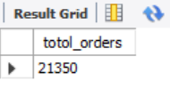
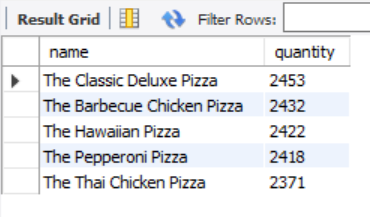

# 🍕 Pizza Sales Analysis using SQL

## 📌 Project Overview

This project analyzes pizza sales data using SQL to uncover insights related to revenue, customer behavior, and product performance.

The goal is to solve real-world business questions using structured query techniques such as joins, aggregations, and window functions.

---

## 🎯 Objective

* Measure total sales performance
* Identify top-selling pizzas and categories
* Understand ordering patterns
* Analyze revenue trends over time

---

## 🛠️ Tools Used

* MySQL
* SQL (Joins, Aggregations, Subqueries, Window Functions)

---

## 📂 Dataset

The dataset includes:

* **orders** – order date & time
* **order_details** – quantity per order
* **pizzas** – size & price
* **pizza_types** – name & category

---

## 📁 Project Structure

```id="7v1j7s"
pizza-sales-sql/
│
├── dataset/
│   ├── orders.csv
│   ├── order_details.csv
│   ├── pizzas.csv
│   ├── pizza_types.csv
│
├── sql/
│   ├── basic_queries.sql
│   ├── intermediate_queries.sql
│   ├── advanced_queries.sql
│
├── presentation/
│   └── pizza_sales_analysis.pdf
│
├── screenshots/
│   ├── total_orders.png
│   ├── revenue.png
│   ├── top_pizzas.png
│
└── README.md
```

---

## 🔍 Key Analysis

### 🟢 Basic

* Total number of orders
* Total revenue
* Highest-priced pizza
* Most common size
* Top 5 pizzas

### 🟡 Intermediate

* Category-wise quantity
* Orders by hour
* Average pizzas per day
* Top pizzas by revenue

### 🔴 Advanced

* Revenue contribution (%)
* Cumulative revenue trend
* Top pizzas by category

---

## 📸 Sample Outputs

### Total Orders



### Revenue Calculation


### Top 5 Pizzas



---

## 📈 Key Insights

* A few pizza types contribute a large share of revenue
* Peak ordering occurs during specific hours of the day
* Larger pizza sizes are more frequently ordered
* Revenue shows a cumulative growth trend over time

---

## ⚠️ Disclaimer

This project is for learning and portfolio purposes only.
The dataset is publicly available and does not represent real business data.

---

## 👨‍💻 Author

**Dixit**

---
